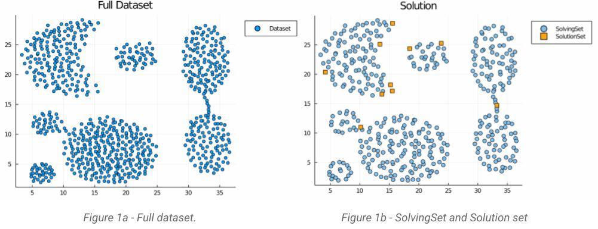
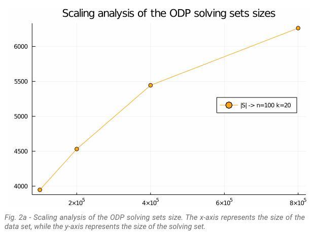
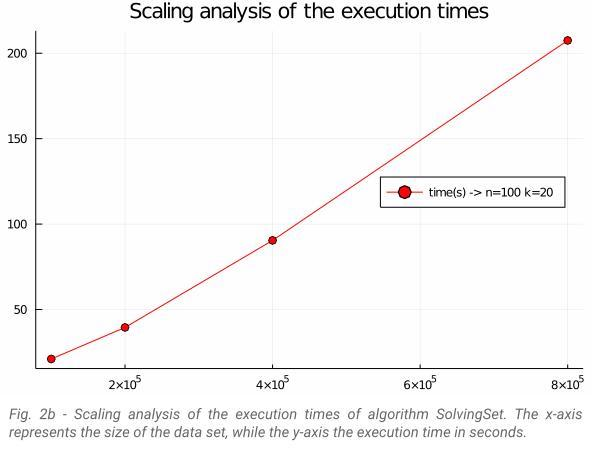

# ODPSolvingSet
Project work for "Data Mining" (held by Prof. Claudio Sartori) University of Bologna.

### Introduction
This project work aims to implement a Distance-Based Detection and Prediction of Outliers algorithm (proposed by 
[Fabrizio Angiulli, Stefano Basta, and Clara Pizzuti](https://ieeexplore.ieee.org/document/1563979)),
in Julia, a general purpose programming language, designed for high computation purposes: an essential peculiarity for calculating distances on large scale datasets.

For a detailed report, consult [this pdf](/ODPSolvingSet_AlessandroFranca.pdf)






### Usage
One of the great things about the Julia programming language is that it is very easy to manage the dependencies of your project.
Two files Project.toml and Manifest.toml uniquely specify which packages are needed.

If not specified otherwise, Julia is started in a default (global) environment.

In order to run the ODPSolvingSet algorithm follow the following steps:

1. Start a new Julia session and, in the Julia REPL, press `]` to switch to package manager mode.

2. Activate the ODPSolvingSet environment, by typing:
      ```
      julia> activate "ODPSolvingSet_path"
      ```
      In this way, all dependencies will be read from Project.toml and Manifest.toml
2. run "`Main.jl`"
